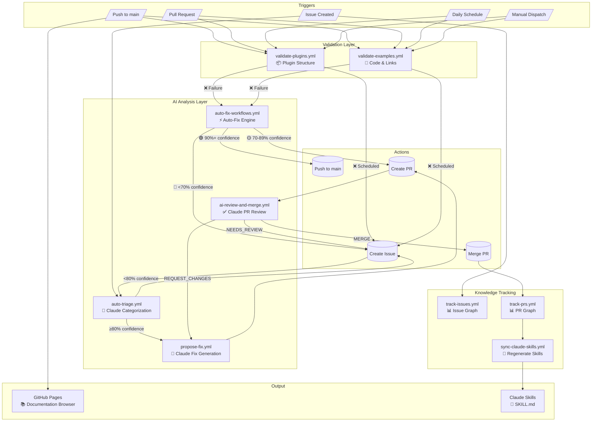
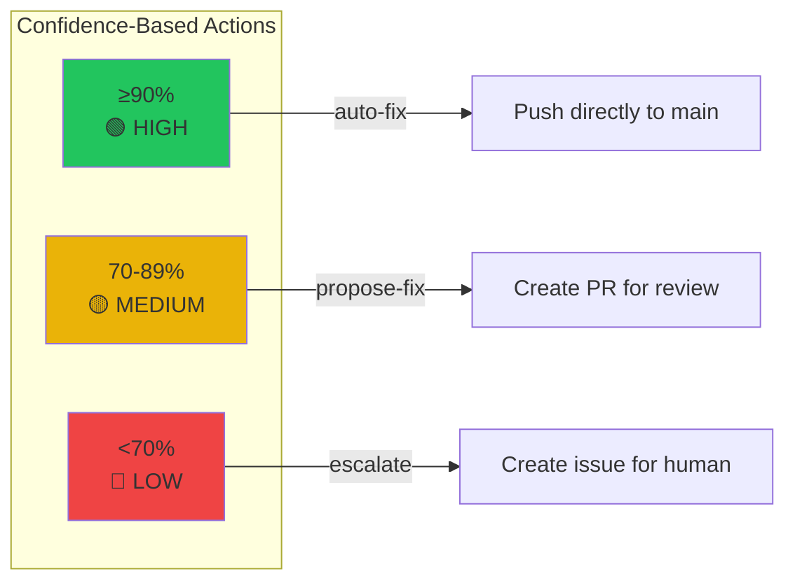
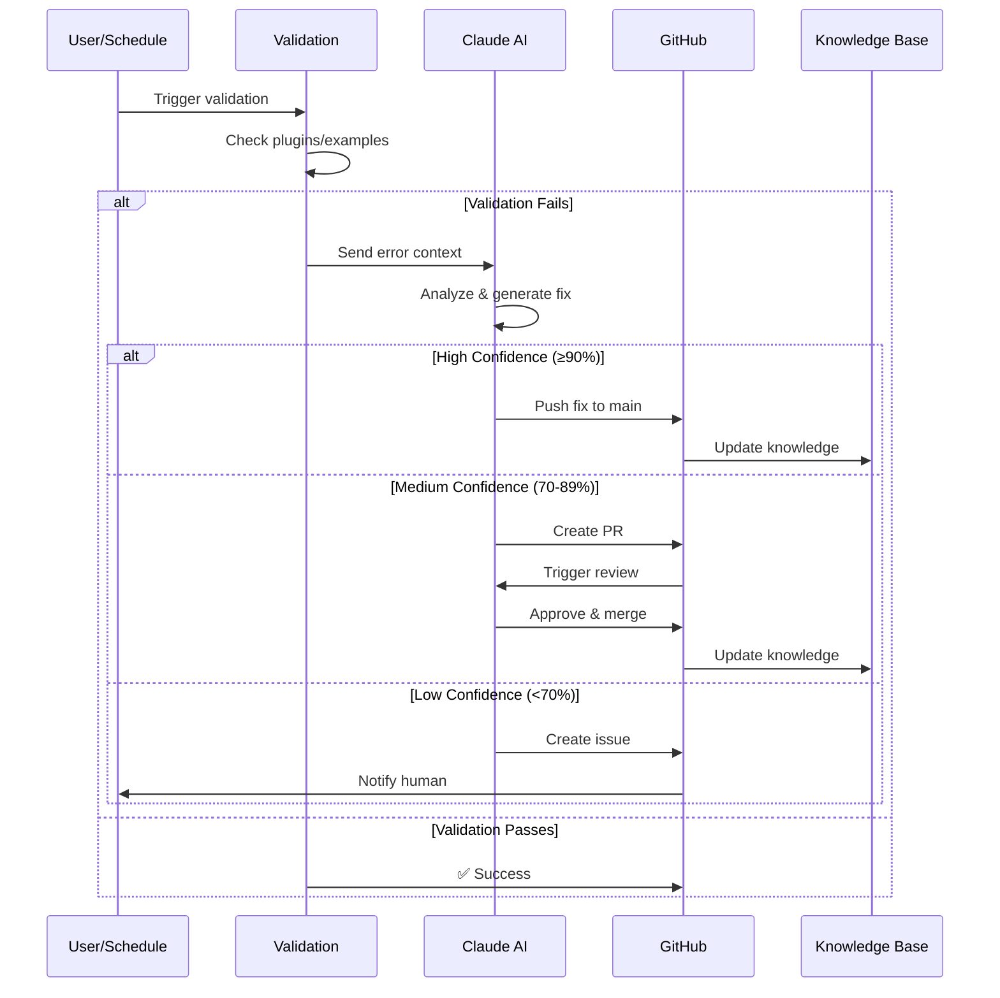

# Self-Healing CI/CD System

This repository implements a self-healing knowledge system powered by Claude AI.

## System Architecture



## Workflow Descriptions

### Validation Workflows

| Workflow | Trigger | Purpose |
|----------|---------|---------|
| `validate-plugins.yml` | Push, PR, Schedule, Manual | Validates marketplace.json and plugin.json schemas |
| `validate-examples.yml` | Push, PR, Schedule, Manual | Checks Python syntax in SKILL.md, validates documentation links |

### AI-Powered Workflows

| Workflow | Trigger | Purpose |
|----------|---------|---------|
| `auto-triage.yml` | Issue with `auto-report` label | Claude analyzes issue, assigns category & confidence |
| `propose-fix.yml` | High-confidence triage or manual | Claude generates documentation fix |
| `ai-review-and-merge.yml` | PR from bot | Claude reviews PR, decides merge/iterate/escalate |
| `auto-fix-workflows.yml` | Failed validation workflows | Claude analyzes failure, auto-fixes or creates issue |

### Tracking Workflows

| Workflow | Trigger | Purpose |
|----------|---------|---------|
| `track-issues.yml` | Issue events | Updates knowledge graph with issue data |
| `track-prs.yml` | PR events | Updates knowledge graph, triggers skill sync |
| `sync-claude-skills.yml` | Doc changes | Regenerates SKILL.md from source docs |

### Deployment

| Workflow | Trigger | Purpose |
|----------|---------|---------|
| `deploy-ui.yml` | Push to automation/web/ | Deploys Documentation Browser to GitHub Pages |

## Confidence Thresholds



## Self-Healing Loop



## File Structure

```
.github/workflows/
├── validate-plugins.yml      # Plugin structure validation
├── validate-examples.yml     # Code & link validation
├── auto-fix-workflows.yml    # Automatic error fixing
├── auto-triage.yml          # Issue categorization
├── propose-fix.yml          # Fix generation
├── ai-review-and-merge.yml  # PR review & merge
├── track-issues.yml         # Issue tracking
├── track-prs.yml            # PR tracking
├── sync-claude-skills.yml   # Skill regeneration
└── deploy-ui.yml            # Documentation deployment
```

## Links

- [Documentation Browser](https://zdeneksrotyr.github.io/xmas-challenge-fork/)
- [GitHub Actions](https://github.com/ZdenekSrotyr/xmas-challenge-fork/actions)
