# Self-Healing CI/CD System

This repository implements a self-healing knowledge system powered by Claude AI.

## System Architecture

```mermaid
flowchart TB
    subgraph Triggers["Triggers"]
        PUSH[/"Push to main"/]
        PR[/"Pull Request"/]
        SCHEDULE[/"Daily Schedule"/]
        ISSUE[/"Issue Created"/]
        MANUAL[/"Manual Dispatch"/]
    end

    subgraph Validation["Validation Layer"]
        VP["validate-plugins.yml<br/>📦 Plugin Structure"]
        VE["validate-examples.yml<br/>🧪 Code & Links"]
    end

    subgraph AI["AI Analysis Layer"]
        TRIAGE["auto-triage.yml<br/>🤖 Claude Categorization"]
        FIX["propose-fix.yml<br/>🔧 Claude Fix Generation"]
        REVIEW["ai-review-and-merge.yml<br/>✅ Claude PR Review"]
        AUTOFIX["auto-fix-workflows.yml<br/>⚡ Auto-Fix Engine"]
    end

    subgraph Actions["Actions"]
        PUSHM[("Push to main")]
        CREATEPR[("Create PR")]
        CREATEISSUE[("Create Issue")]
        MERGE[("Merge PR")]
    end

    subgraph Tracking["Knowledge Tracking"]
        TRACK_I["track-issues.yml<br/>📊 Issue Graph"]
        TRACK_PR["track-prs.yml<br/>📊 PR Graph"]
        SYNC["sync-claude-skills.yml<br/>🔄 Regenerate Skills"]
    end

    subgraph Output["Output"]
        PAGES["GitHub Pages<br/>📚 Documentation Browser"]
        SKILLS["Claude Skills<br/>🧠 SKILL.md"]
    end

    %% Trigger connections
    PUSH --> VP
    PUSH --> VE
    PR --> VP
    PR --> VE
    SCHEDULE --> VP
    SCHEDULE --> VE
    ISSUE --> TRIAGE
    ISSUE --> TRACK_I
    MANUAL --> VP
    MANUAL --> VE

    %% Validation flow
    VP -->|"❌ Failure"| AUTOFIX
    VE -->|"❌ Failure"| AUTOFIX
    VP -->|"❌ Scheduled"| CREATEISSUE
    VE -->|"❌ Scheduled"| CREATEISSUE

    %% Auto-fix flow
    AUTOFIX -->|"🟢 90%+ confidence"| PUSHM
    AUTOFIX -->|"🟡 70-89% confidence"| CREATEPR
    AUTOFIX -->|"🔴 <70% confidence"| CREATEISSUE

    %% Issue flow
    CREATEISSUE --> TRIAGE
    TRIAGE -->|"≥80% confidence"| FIX
    TRIAGE -->|"<80% confidence"| CREATEISSUE

    %% PR flow
    FIX --> CREATEPR
    CREATEPR --> REVIEW
    REVIEW -->|"MERGE"| MERGE
    REVIEW -->|"REQUEST_CHANGES"| FIX
    REVIEW -->|"NEEDS_REVIEW"| CREATEISSUE

    %% Tracking
    MERGE --> TRACK_PR
    TRACK_PR --> SYNC

    %% Output
    SYNC --> SKILLS
    PUSH --> PAGES
```



## Workflow Descriptions

### Validation Workflows

| Workflow | Trigger | Purpose |
|----------|---------|---------|
| `validate-plugins.yml` | Push, PR, Schedule, Manual | Validates marketplace.json and plugin.json schemas |
| `validate-examples.yml` | Push, PR, Schedule, Manual | Checks Python syntax in SKILL.md, validates documentation links |

### AI-Powered Workflows

| Workflow | Trigger | Purpose |
|----------|---------|---------|
| `auto-triage.yml` | Issue with `auto-report` label | Claude analyzes issue, assigns category & confidence |
| `propose-fix.yml` | High-confidence triage or manual | Claude generates documentation fix |
| `ai-review-and-merge.yml` | PR from bot | Claude reviews PR, decides merge/iterate/escalate |
| `auto-fix-workflows.yml` | Failed validation workflows | Claude analyzes failure, auto-fixes or creates issue |

### Tracking Workflows

| Workflow | Trigger | Purpose |
|----------|---------|---------|
| `track-issues.yml` | Issue events | Updates knowledge graph with issue data |
| `track-prs.yml` | PR events | Updates knowledge graph, triggers skill sync |
| `sync-claude-skills.yml` | Doc changes | Regenerates SKILL.md from source docs |

### Deployment

| Workflow | Trigger | Purpose |
|----------|---------|---------|
| `deploy-ui.yml` | Push to automation/web/ | Deploys Documentation Browser to GitHub Pages |

## Confidence Thresholds

```mermaid
graph LR
    subgraph Confidence["Confidence-Based Actions"]
        C90["≥90%<br/>🟢 HIGH"]
        C70["70-89%<br/>🟡 MEDIUM"]
        C0["<70%<br/>🔴 LOW"]
    end

    C90 -->|"auto-fix"| A1["Push directly to main"]
    C70 -->|"propose-fix"| A2["Create PR for review"]
    C0 -->|"escalate"| A3["Create issue for human"]

    style C90 fill:#22c55e
    style C70 fill:#eab308
    style C0 fill:#ef4444
```



## Self-Healing Loop

```mermaid
sequenceDiagram
    participant U as User/Schedule
    participant V as Validation
    participant AI as Claude AI
    participant GH as GitHub
    participant KB as Knowledge Base

    U->>V: Trigger validation
    V->>V: Check plugins/examples

    alt Validation Fails
        V->>AI: Send error context
        AI->>AI: Analyze & generate fix

        alt High Confidence (≥90%)
            AI->>GH: Push fix to main
            GH->>KB: Update knowledge
        else Medium Confidence (70-89%)
            AI->>GH: Create PR
            GH->>AI: Trigger review
            AI->>GH: Approve & merge
            GH->>KB: Update knowledge
        else Low Confidence (<70%)
            AI->>GH: Create issue
            GH->>U: Notify human
        end
    else Validation Passes
        V->>GH: ✅ Success
    end
```



## File Structure

```
.github/workflows/
├── validate-plugins.yml      # Plugin structure validation
├── validate-examples.yml     # Code & link validation
├── auto-fix-workflows.yml    # Automatic error fixing
├── auto-triage.yml          # Issue categorization
├── propose-fix.yml          # Fix generation
├── ai-review-and-merge.yml  # PR review & merge
├── track-issues.yml         # Issue tracking
├── track-prs.yml            # PR tracking
├── sync-claude-skills.yml   # Skill regeneration
└── deploy-ui.yml            # Documentation deployment
```

## Links

- [Documentation Browser](https://zdeneksrotyr.github.io/xmas-challenge-fork/)
- [GitHub Actions](https://github.com/ZdenekSrotyr/xmas-challenge-fork/actions)
